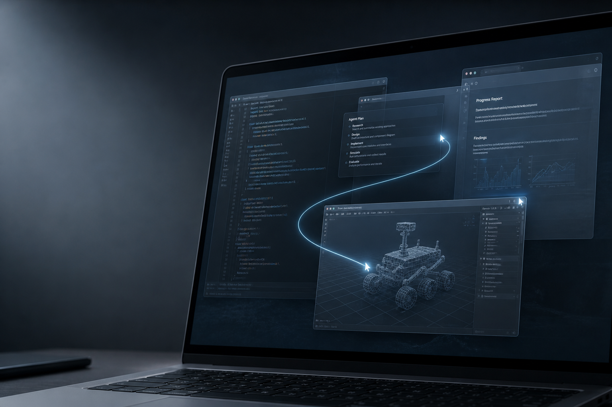
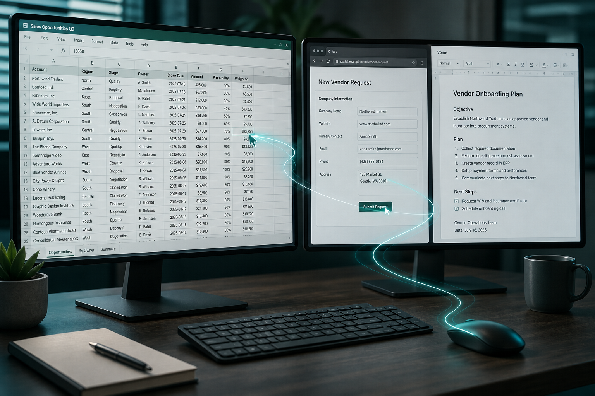
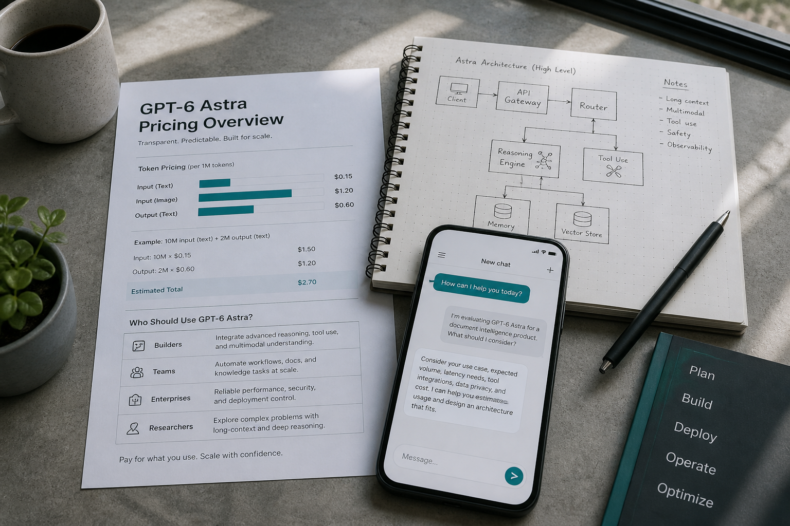

# GPT-6 来了：OpenAI 说「欢迎来到 AGI 时代」，我们该信几分？

> 公众号成稿｜建议封面用 `images/cover-gpt6-astra.png`  
> 适合直接复制到微信公众号编辑器；配图已按章节顺序排好。

---

九月初，OpenAI 把那款传闻了整个八月的模型正式推到台前：

**GPT-6 Astra。**

发布会上，联合创始人 Greg Brockman 收尾只用了一句很重的话：

**「Welcome to the AGI era.」**

欢迎来到 AGI 时代。

这句话足够刷屏。  
但刷屏之后，真正值得追问的，其实只有三件事：

它到底强在哪？  
「AGI 时代」是判断，还是口号？  
普通人、开发者、公司，现在该怎么用？

---

## 01｜别再把它当成「更会聊天的 ChatGPT」

过去两年，大家习惯了这样用大模型：

问一句，答一句；  
写一段代码，再改一轮；  
让它给建议，人自己去点鼠标。

Astra 想改的，是这套交互本身。

OpenAI 把它定位成：**目前最好的 computer use 模型**——不是只会告诉你「下一步点哪里」，而是自己去操作软件、跨应用把事做完。

演示里很有象征意味：  
从八十年代那台只会画黄圈的电脑，切到今天——语音一声，黄圈变成火箭，再变成一整个 3D 小游戏；甚至还能顺手挂上 eBay。

听起来像广告片。  
但企业侧真正关心的，是更朴素的能力：

- 填表、改 CRM、整理日历  
- 做网页调研，再落成文档或邮件  
- 操作表格、跑分析、写演示稿  
- 在工程软件里完成更长链路的任务  

一句话概括：

**从「陪你说话的助手」，变成「能替你干活的代理」。**

人的角色，也从不断喂 prompt，变成更高层的监督与拍板。

---

## 02｜数字很好看，但别只盯着分数

官方给出的成绩单确实扎眼，例如：

- ARC-AGI-3：**98.6%**  
- FrontierMath Tier 4 v2：**97.6%**  
- DeepSWE v1.1：**74.1%**  
- OSWorld 2.0 离线子集：约 **72.6%**，单任务耗时比上代明显更短  

还有一组更「产品向」的说法：  
复杂推理、编程、科研、文档创作、电脑操作，都被放到同一块「端到端硬活」里。

上下文窗口也来到约 **105 万 tokens** 量级，输出上限约 **12.8 万 tokens**。  
知识截止到 **2026 年 4 月 30 日**。

这些数字能说明一件事：  
**Astra 不是小修小补，而是一次明显的能力跃迁。**

但也有两个冷静提醒，值得写进正文：

**第一，基准分不等于真实工作流。**  
ARC 这类测试，模型和「外挂系统」（记忆、工具、编排）怎么配，结果可以差很多。分数高，说明系统强；至于强在权重里，还是强在整套 agent 管线，企业采购时其实更该看稳定性、可审计性、失败恢复。

**第二，OpenAI 自己最贴近「经济价值」的 GDPval，这次并没有成为核心叙事。**  
如果口号是「AGI 时代」，大家自然会问：它在真实职业任务上，到底比上代强多少？目前公开材料更像一张能力拼图，而不是一张统一的经济价值成绩单。

所以更稳妥的判断是：

**Astra 很强，尤其强在「长时间、跨软件把事情做完」；  
至于是不是 AGI，现在更像一场定义之争，而不是开关被按下的那一刻。**

---

## 03｜「AGI 时代」该怎么听？

Brockman 自己也承认：大家对 AGI 的定义并不一样。  
OpenAI 创立时以为会有一个所有人都一眼认出的「那一天」；现实却更灰、更模糊。

他个人的态度很直接：

**「对我来说，我觉得我们已经到了。」**

这句话适合做标题，不适合当结论。

更贴近工作现场的听法，或许是：

- 如果 AGI 指「聊天更聪明」——这关早过了  
- 如果 AGI 指「能在多数高价值工作上稳定替代专业人士」——证据还在积累  
- 如果 AGI 指「人开始把复杂多步工作委托给系统，自己只做高层决策」——**Astra 正在把这件事做成产品形态**

对多数读者来说，第三种定义最有用。

因为你不需要先说服自己「人类历史翻页了」，也能立刻感受到变化：

**工具正在从回答问题，转向接管流程。**

---

## 04｜贵不贵？谁现在就该上？

API 公开价大致是：

- 输入：**$10 / 百万 tokens**  
- 缓存输入：**$1 / 百万 tokens**  
- 输出：**$50 / 百万 tokens**  

相对此前旗舰，贵一截。  
超长上下文（输入超过约 27.2 万 tokens）还会触发更高费率；还有 Fast / Batch 等不同计费档。

访问上，是分批放开：企业受信通道（Daybreak / Trusted Access）先行，再逐步覆盖 ChatGPT 付费档与 API。  
不同渠道对 Plus / Pro 的表述仍有滚动更新，**以你账号里实际可选模型为准**。

怎么判断自己要不要马上跟？

**适合尽快试的人**
- 工作里大量「跨网页 + 表格 + 文档」的脏活  
- 已有明确的 agent / computer use 场景  
- 能接受更高单价，换更少人工串流程  

**可以再等等的人**
- 主要需求仍是写作、总结、轻量问答  
- 对成本敏感，且现有模型已经够用  
- 还没想清楚失败时谁负责、日志怎么留  

一句话：

**Astra 不是给所有人的「默认新模型」，更像给高复杂度工作流准备的重型工具。**

---

## 05｜写给做内容、做产品、做管理的人

如果只看热闹，「OpenAI 又发大模型了」就够了。  
如果看趋势，有三件事更值得记下：

**1. 交互范式在变**  
以后比拼的不只是谁答得漂亮，而是谁更能在真实软件里把任务闭环。

**2. 组织方式会变**  
员工从「自己操作软件」，更多变成「设定目标、审核结果、处理例外」。中间那段点击与搬运，正在被模型吃掉。

**3. 信任与治理会更重要**  
越是能自己点鼠标的系统，越需要权限边界、操作回放、人工确认点。能力越强，治理越不能省。

这也是为什么，我对「欢迎来到 AGI 时代」这句话的态度是：

**可以认真听，但请带着产品经理的眼睛听。**

它宣布的不是神话完结，而是：

**自动化的主战场，已经从对话框，挪到了桌面与浏览器里。**

---

## 结尾｜先别急着站队

GPT-6 Astra 值得兴奋。  
它把「agent 能干活」这件事，推到了一个更接近日常办公的位置。

但它还没到可以不问代价、不问边界、不问失败率就全盘托付的程度。

更聪明的姿势，或许是：

选一个真实、重复、可验收的工作流，  
让它跑一周，  
用结果说话。

分数会过时，口号会褪色。  
**能不能稳定把活干完，才是下一阶段真正的评测。**

---

如果你也在试 Astra，欢迎把你的真实场景留在评论区。  
我们下期继续拆：哪些工作流最先值得交给 computer use。

**点个「在看」，把这篇文章转给还在把 AI 当聊天框用的同事。**
