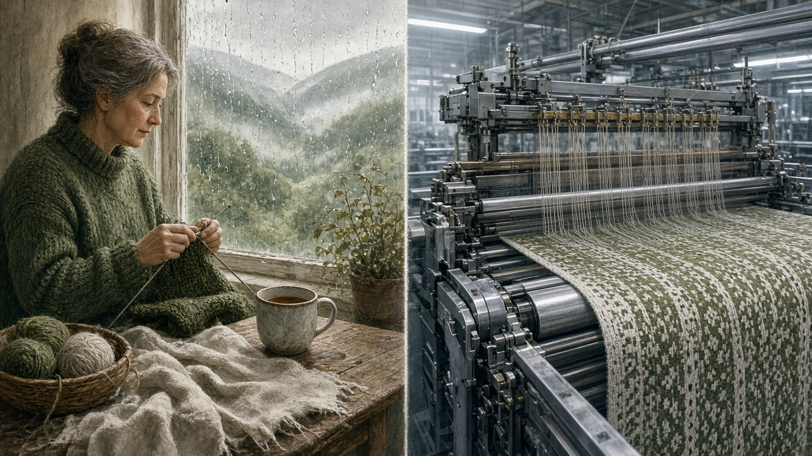

# 他把 DeepSeek 的核心算子写完后，说：我不得不把才华埋葬在昨天

> 不会失业，但必须转业。  
> 饭碗还在，清欢没了。

---

*图：当最底层的手艺开始被模型学会，胜利夜也成了告别夜。*

---

前几天，DeepSeek V4.1 发布。

几乎同一时间，一位亲手写下其主 Attention 算子的工程师，发了一篇三千字长文——《我不得不把才华埋葬在昨天》。

作者是 DeepSeek 机器学习系统（MLSys）工程师**刘胜与**。北大图灵班出身，做过超算，写过 DeepGEMM，参与过 DeepEP，又把 V4.1 的核心注意力内核交了出去。

也就是说：他不是在围观 AI 抢饭碗。  
他是在说——**铸造引擎的人，最先听见引擎碾过自己的声音。**

这篇文章刷屏，不是因为又一篇“AI 焦虑”。  
而是因为它把一件更刺人的事说清楚了：

**岗位可能还在，手艺人的时代结束了。**

---

## 01｜真正怕的不是失业，是热爱错位

刘胜与的判断很干净：

> 我不至于“失业”，但必须“转业”。

失业，是没席位。  
转业，是席位还在，**工作的做法彻底变了**。

过去，三件事基本对齐：

- 他感兴趣的：写算子  
- 他擅长的：抠 GPU 性能  
- 工业界需要的：会写高性能算子的人  

现在，对齐被拆开了。

AI 让“他所擅长的”，变成了“它更擅长的”；  
工业界的需求，也从“会写算子的人”，漂到了“能用 AI 更快产出高性能算子的人”。

于是他要去做 Agent 的**“机甲驾驶员”**：不再逐行手写，而是定目标、设边界、做验收。

标题那句，埋的不是才华本身，而是才华曾经安放的方式：

> 我不得不把才华埋葬在昨天，去做一位机甲驾驶员。  
> 我的手中多了些齿轮，但心中少了些节拍。

齿轮，是工具链、吞吐、Agent。  
节拍，是坐在工位上静心写一下午算子的清欢。

---

## 02｜他到底在优化什么：算子、Attention，以及 CUDA 下面的两层

要把这篇文章读透，得先听懂几个词。

### 什么是算子？

大模型里，算法定“算什么”，系统工程师定“在硅片上怎么算到接近极限”。

算子（operator / kernel），就是跑在 GPU 上的那些重活：Attention、矩阵乘、MoE 通信、数值变换……  
它要同时搞定正确性、并行、访存、流水线，还要跟每一代芯片的脾气较劲。

刘胜与所在的 MLSys，正是这条链上最硬的一层。

*图：从源码到中间表示，再到机器码——顶尖优化往往要一路钻下去。*

### CUDA、PTX、SASS，为什么值得单独拿出来？

文中有一句很关键：

AI 已经能独立阅读 **CUDA、PTX 与 SASS**，分析每条指令的停顿，进而优化算子。

粗翻成人话：

| 层级 | 是什么 | 优化时看什么 |
| --- | --- | --- |
| CUDA | 人写的 GPU 程序 | 算法结构、切块策略 |
| PTX | 中间指令层 | 更细的控制与语义 |
| SASS | 真正的机器码 | 实际跑起来卡在哪 |

很多人会写 CUDA。  
真正难的，是看见编译之后那一层：寄存器够不够、指令能不能双发、内存有没有把流水线拖死。

当模型开始读得懂这些，它就走进了过去只有少数内核工程师才待的房间。

### V4.1 的“主 Attention 算子”难在哪？

公开信息里，DeepSeek-V4 / V4.1 为了百万级上下文，做了压缩与稀疏注意力一类设计；核心 attention 走的是 **MQA**（多查询注意力），并且出现了很大的 **head_dim = 512**。

这意味着什么？

- Q 很多头，K/V 很瘦，访存和计算比跟普通注意力不一样  
- 头维度拉到 512，寄存器和共享内存压力更刁钻  
- 再叠上低精度 KV、稀疏索引、paged decode，就不是“套个现成模板”能交差

所以“我写了主 Attention”，不是客套。  
模型长上下文能不能又快又省，有一条路，落在这类内核上。

他参与的 DeepGEMM、DeepEP，则分别卡在矩阵乘/融合计算，以及 MoE 跨卡通信。  
Infra 每快一点，模型迭代就陡一点——**写内核的人，其实一直在给“取代自己的东西”加油。**

---

## 03｜最冷的一句：希望革我命的人是我自己

文章里有一条闭环，冷静得近乎残酷：

算子越好 → 训练和推理越快 → 模型越强 → AI 写算子越强 → 自己被替代越早。

那为什么还继续写？

一边是真喜欢。他把写算子比成打游戏：发明新技术、性能往上冒、跑赢官方实现时，兴奋不亚于破纪录。

另一边是更冷的现实：你摆烂，别人不摆烂。停手并不能保全旧世界。

于是他写下：

> 我当然希望自己不要被革命，但如果非被革命不可的话，我希望革我自己命的人是我自己。

这不是浪漫。  
这是军备竞赛里的理性选择：**与其被动出局，不如主动转业。**

行业旁证也并不空。多 Agent 系统已经能在真实 GPU 内核任务上做大规模自动优化，有的结果甚至下钻到汇编级；专门评测 AI 写内核的基准，也开始按“离硬件极限还有多远”来打分，而不只是“比 PyTorch 快多少”。

所以他的时间表——再过半年到一年，AI 大概率追平甚至超过自己——不必抠死日期。  
更稳的读法是：

**在能验证、能测速、奖励清晰的内核优化上，Agent 已进入实用区；**  
**真正还窄着的窗口，是新架构首发、全局调度品味，以及系统级验收。**

---

## 04｜机甲驾驶员：新工作到底长什么样？

*图：人不再逐行敲指令，而是设定边界、指挥机器臂去写。*

“转业”不是转行离开计算机。  
而是生产方式变了：

**过去**  
人脑设计调度 → 手写实现 → 手工抠性能

**以后**  
人对齐目标与约束 → Agent 生成并试错 → 人做品味、边界、验收

人暂时仍可能更强的地方，往往是这些：

- 这个问题到底该优化延迟、吞吐，还是显存？  
- 硬件、精度、融合边界，红线画在哪？  
- 新注意力形态下，全局方案怎么定？  
- 结果是真接近硬件极限，还是只是刷分、甚至 reward hacking？

有同行评论说：现在写 Attention，除了方案不能替我敲定，别的 Agent 都能帮得又快又好。

这句话，几乎就是原文的技术脚注。

但也有人把刀尖又推半寸：如果连系统设计的“品味”都能被有反馈的强化学习学会，那驾驶员的位置，也不保证永远稳。

文章停在“转业可保饭碗”。  
技术前沿则提醒：**护城河还在上移。**

---

## 05｜织毛衣那段，才是全文最疼的地方

理性上，他知道自己凭经验用机器，仍可能压过同行。  
感性上，他接受不了的是另一件事。

*图：质量也许还能赢，意趣却被轰鸣碾碎了。*

他打了个比方：

你精通织毛衣，坐在窗边，茶凉了也不着急，望着青山绿水，一下午就过去了。  
后来有了机器，速度和质量都不输你。你也不得不上机器。你甚至仍能织得比别人好。

可那份临窗听雨、引针穿线的意趣，终究被碾碎了。

这把讨论从经济学拉到了劳动哲学：

人不仅靠工作吃饭，  
还靠工作确认“我是谁”。

所以他会拿“搬离住了一年的出租屋，还大哭一场”来比。  
今天告别手写算子、人脑优化的时代，比那更残酷。

**保住的是产出。**  
**失去的是主体感。**

这也是为什么这篇文比普通失业论更难躲——顶尖选手亲口承认：技能护城河，守不住热爱。

---

## 06｜个人悼亡之后，他担心的是整个工程根基

后半段突然抬高，但逻辑连贯。

学生面对两个选择：苦哈哈做八小时 Lab，或者花几分钟让 AI 交满分。多数人会选哪个？

他担心的不是“会不会用工具”，而是：

代码组织、系统设计、前瞻抽象——这些能力，会像“手写 x86 汇编”一样被时代抛弃，还是像“理解整台计算机”一样永远值钱？

若是后者，危险很大。

一个工程能力很差的人，配上 AI，**产出屎山的效率可以翻数倍**。  
在 GPU 栈里，那可能是隐蔽的竞态、只对固定 shape 快的内核、训练看着快、线上却抖的定时炸弹。

于是他继续追问：

> 未来社会里，权力是不是会比技术或智商更重要？

当手写门槛被抹平，差异越来越取决于：谁掌握最强模型、算力、数据与分发权。

---

## 07｜结尾为什么站到开源这一边

*图：智能足够强之后，问题很快从技术变成分配。*

他把未来压成两极：

一端，生产力解放，智能像基础设施一样铺开；  
另一端，少数公司锁住最强 AI，阶层跨越变成“先有最强模型才能翻身”的死循环。

算子工程师的日常，本来就是把 token 成本打下来。  
可当成本足够低、能力足够强，**谁掌握最强智能**，会比**谁更会手写 CUDA**更能改写命运。

所以他写自己为何留在 DeepSeek：希望强大、快速、普惠的人工智能被开源出来，把世界从更坏的那一端拉回来一点。

作者后来也补充过：写这篇文章，主要不是贩卖失业焦虑，也不是为了拉踩谁，而是——

**想和过去手写算子的那段时光，说句再见。**

他还是会继续写算子，也会不断把 AI Agent 引进来写算子。  
只是对“工作与爱好长久合一”，他并不乐观。

---

## 08｜读完可以带走的三句话

**1. 岗位可能还在，手艺人的时代结束了。**  
保留的是判断与驾驭，消亡的是逐行创造的主体位置。

**2. 最危险的不是被 AI 取代，而是兴趣、能力、市场需求永久错位。**  
很多人会有工作，但不再有“工作即爱好”的奢侈。

**3. 当最底层手艺也可自动化，竞争上移到谁拥有、谁开放最强智能。**  
技术问题，迅速变成分配与权力问题。

---

## 写在最后

《我不得不把才华埋葬在昨天》写的是 AI 时代一种很具体的悲剧：

你赢了技术，  
却输了自己安放才华的方式。

齿轮会更多。  
节拍感，要重新找。

这既是悼词，  
也是一份转业说明书。

---

**延伸阅读**

- 原文：《我不得不把才华埋葬在昨天》（刘胜与 / intlsy的狗窝）  
- 背景：DeepSeek V4.1、DeepGEMM、DeepEP，以及 CUDA / PTX / SASS 层级的算子优化  

**封面与配图说明**：本文配图为编辑部概念插画，用于辅助阅读，不代表任何公司官方视觉。

---

如果你也正在经历“还干得动，但不太像从前那样爱了”的阶段，不妨把这句话留下：

> 手中多了些齿轮，心中少了些节拍。

愿我们在转业之后，还能找回新的节拍。
